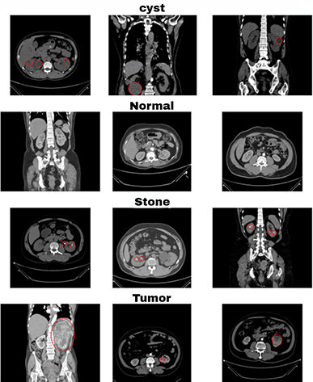

<h1>Kidney Disease Classification</h1>

End-to-end kidney disease classification by finetuning VGG-16.



<h3>Built With</h3>

+ [Tensorflow](https://github.com/tensorflow/tensorflow)
+ [DVC](https://github.com/iterative/dvc)
+ [MLFLOW](https://github.com/mlflow/mlflow)
+ [FastAPI](https://github.com/tiangolo/fastapi)
+ [Streamlit](https://streamlit.io/)
+ [Containerization with Docker](https://docs.docker.com/get-started/overview/)
<!-- + [Amazon AWS deployment](https://aws.amazon.com/)
+ [CI/CD with Github Actions](https://github.com/features/actions) -->

<h3>Dataset</h3>

[Kidney CT scan Kaggle Dataset](https://www.kaggle.com/datasets/nazmul0087/ct-kidney-dataset-normal-cyst-tumor-and-stone/data)

Classes: cyst, tumor, stone, and normal

## How to run

+ STEP 01- Clone the repository

```bash
git clone https://github.com/dahshury/Kidney-Disease-Classification-DL-Project
```

+ STEP 02- Create a conda environment after opening the repository (optional)

```bash
conda create -n kidney python=3.8 -y
```

```bash
conda activate kidney
```

+ STEP 03- install the requirements

Installing dependancies from requirements.txt

```bash
pip install -r requirements.txt
```

Dependancies for training using GPU (optional):

```bash
conda install -c conda-forge cudatoolkit=11.2 cudnn=8.1.0
```


### To Run prediction using the pretrained model

run the following command in the terminal for the streamlit web app

```bash
python app2.py
```

OR
alternatively, you can use the html app

```bash
python app.py
```

After launching either app, open the following link in the browser

```bash
localhost:8080
```

You can now upload an image of a desired category, and click predict for the result.


<h3>Results</h3>

trainig loss: 0.5373 - accuracy: 0.9007 - val_loss: 2.3800, val_accuracy: 0.7181

<h3>Contact Me</h3>

[Linkedin](https://www.linkedin.com/in/dahshory/)

<h3>Acknowledgements</h3>

The project was guided by [DSwithBappy Youtube channel](https://www.youtube.com/@dswithbappy/videos).